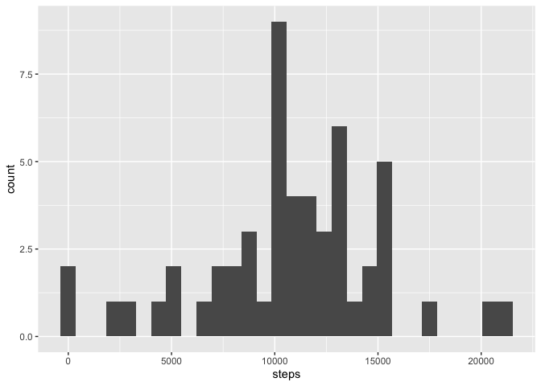
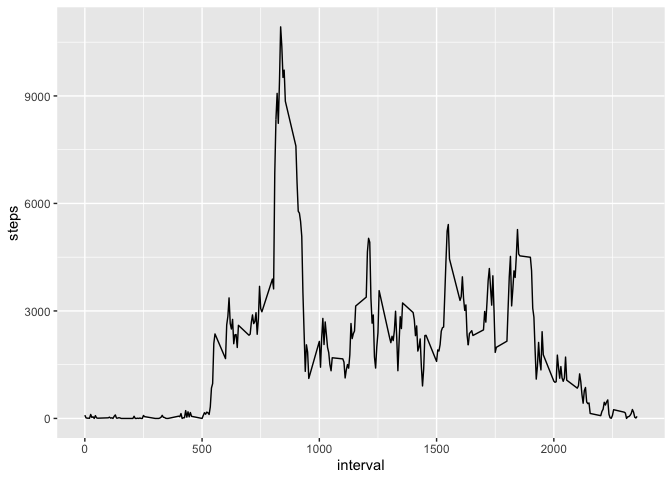
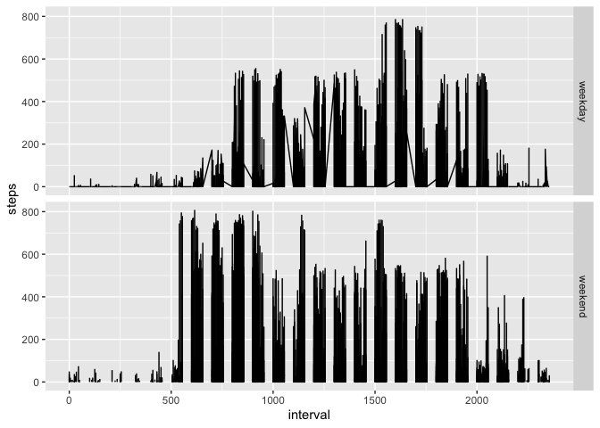

## Loading and preprocessing the data
Load the data then convert the date column to date format.

```r
activity <- read.csv('activity.csv')
activity$date <- as.Date(activity$date)
```


## What is mean total number of steps taken per day?

```r
step_date <- aggregate(steps~date, data = activity, sum)
library(ggplot2)
ggplot(data = step_date, aes(x=steps)) + geom_histogram()
```

```
## `stat_bin()` using `bins = 30`. Pick better value with `binwidth`.
```

<!-- -->

```r
mean_step <- mean(step_date$steps)
median_step <- median(step_date$steps)
```
The mean and median of the total number of steps taken per day are 10766.19 and 10765.00 respectively.

## What is the average daily activity pattern?

```r
step_interval <- aggregate(steps~interval, data = activity, sum)
ggplot(step_interval, aes(x=interval, y=steps)) + geom_line()
```

<!-- -->

```r
max_step <- step_interval[which.max(step_interval$steps),]$interval
```
5-minute interval 835, on average across all the days in the dataset, contains the maximum number of steps

## Imputing missing values

```r
total_missing <- sum(is.na(activity$steps))
```
There are 2304 missing values in the data.

```r
library(dplyr)
```

```
## 
## Attaching package: 'dplyr'
```

```
## The following objects are masked from 'package:stats':
## 
##     filter, lag
```

```
## The following objects are masked from 'package:base':
## 
##     intersect, setdiff, setequal, union
```

```r
impute.mean <- function(x) replace(x, is.na(x), mean(x, na.rm = TRUE))

activity_impute <- activity %>%
  group_by(interval) %>%
  mutate(
    steps = impute.mean(steps)  
  )
step_date_impute <- aggregate(steps~date, data = activity_impute, sum)
ggplot(data = step_date_impute, aes(x=steps)) + geom_histogram()
```

```
## `stat_bin()` using `bins = 30`. Pick better value with `binwidth`.
```

<!-- -->

```r
mean_impute <- mean(step_date_impute$steps)
median_impute <- median(step_date_impute$steps)
```
The missing values are imputed by the mean for that 5-minute interval. The histogram with imputed values has higher peak. 

The mean and median of the total number of steps taken per day are 10766.19 and 10766.19 respectively.

## Are there differences in activity patterns between weekdays and weekends?

```r
activity$weekend <- 'weekend'
activity[weekdays(activity$date) %in% c('Saturday', 'Sunday'),][['weekend']] <- 'weekday'
names(activity)
```

```
## [1] "steps"    "date"     "interval" "weekend"
```

```r
ggplot(data = activity, aes(interval, steps)) + geom_line() + facet_grid(weekend~.)
```

```
## Warning: Removed 1 row(s) containing missing values (geom_path).
```

<!-- -->

At the weekend, the total of steps is higher.
